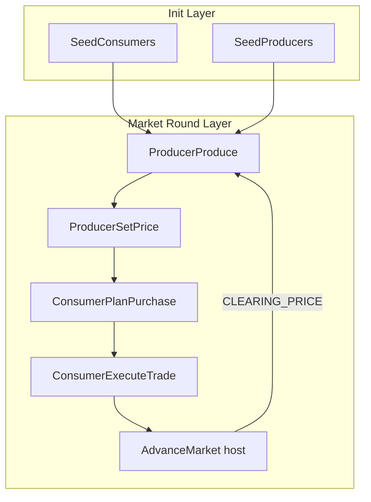

# Initial Implementation Plan — Austrian ABM Simulation

**Status:** Draft  
**Last updated:** 2026-06-17  
**Reference project:** [Wisconsin-PR-Simulation](https://github.com/temotskipa/Wisconsin-PR-Simulation) (same FLAME GPU 2 / CMake layout)

## Vision

Build a GPU-accelerated agent-based economic simulation where macro patterns (prices, trade, capital structure, business cycles) **emerge** from heterogeneous individual agents acting on local knowledge and subjective valuations. The model rejects equilibrium enforcement and representative-agent shortcuts in favor of a genuine **market process**.

## Design Principles

1. **Methodological individualism** — All macro variables are aggregates of agent-level state; no top-down vote or price enforcement.
2. **Subjective value** — Utility and reservation prices are agent-local, not globally imposed.
3. **Entrepreneurial discovery** — Producers discover opportunities through alertness, error, and price signals (Kirzner/Hayek).
4. **Roundabout production** — Capital goods, stages of production, and time preference shape intertemporal coordination (Böhm-Bawerk).
5. **Modular FLAME GPU layout** — Mirror Wisconsin PR: `src/model/`, `src/host/`, `src/domain/`, `src/io/`, `src/data/`.

## Phase 0 — Scaffold (current)

**Goal:** Compilable FLAME GPU 2 project with minimal two-agent-type market loop.

| Item | Status |
|------|--------|
| CMake + FLAME GPU fetch (`cmake/flamegpu2.cmake`) | Done |
| `consumer` and `producer` agents | Done |
| Subjective reservation pricing (`domain/marginal_utility.cuh`) | Done |
| Host price discovery (`host/step_advance_market.cu`) | Done |
| Config via `AUSTRIAN_ABM_*` env vars | Done |
| Unit test for marginal utility | Done |
| Smoke test script | Done |
| README + AGENTS.md | Done |

**Exit criteria:** `cmake --build` succeeds; smoke test runs 6 steps without error; unit tests pass.

## Phase 1 — Market Mechanism Hardening

**Goal:** Replace simplified proportional clearing with a proper decentralized matching process.

### Tasks

- [ ] Add `MessageBruteForce` or `MessageSpatial2D` for local order books (producer ask ↔ consumer bid)
- [ ] Track per-step `TRADES_COUNT`, `VOLUME_WEIGHTED_PRICE` via GPU macro properties
- [ ] Split `AdvanceMarket` into: (a) GPU tally pass, (b) host price update from tallies only
- [ ] Add `tests/test_price_discovery.cpp` for host-side price adjustment math
- [ ] Golden-run baseline: seed=42, 5k consumers, 200 producers, 12 steps → snapshot stdout series

### Non-goals

- No futures markets or derivatives yet
- No multi-good economy yet (single composite good)

## Phase 2 — Reporting and Observability

**Goal:** Structured outputs for analysis and regression testing.

### Tasks

- [ ] `src/io/report_html.cu` — step-by-step price, volume, Gini(cash), inventory distribution
- [ ] `src/host/step_log.cpp` — append `market_steps.jsonl` each step
- [ ] `election_history`-style time series: `market_history.jsonl` with price, demand, supply, trade count
- [ ] Smoke test verifies report artifacts exist (mirror Wisconsin `run_small_sim.ps1`)
- [ ] Optional SVG sparkline for price series

## Phase 3 — Capital and Roundabout Production

**Goal:** Introduce capital goods, investment decisions, and heterogeneous production periods.

### Agent extensions

| Agent | New variables |
|-------|---------------|
| `producer` | `capital_goods`, `labor_hours`, `production_period`, `expected_return` |
| `capital_owner` (new) | `savings`, `time_preference`, `lending_rate` |

### Tasks

- [ ] New `capital_owner` agent type with intertemporal consumption/saving choice
- [ ] Producers bid for capital; owners allocate by expected return vs. time preference
- [ ] Multi-stage production: raw → intermediate → consumer good (env `GOOD_STAGES`)
- [ ] Host function `SyncMarketSignals` copying aggregate prices into env arrays for device lookup
- [ ] Unit tests for present-value calculations and investment threshold math

## Phase 4 — Money and Credit

**Goal:** Medium of exchange and fractional-reserve banking as emergent coordination mechanisms.

### Tasks

- [ ] `bank` agent: deposits, reserves, lending, maturity mismatch
- [ ] Money stock as env macro property; individual cash balances in bank deposits
- [ ] Entrepreneur loan demand driven by expected profit vs. interest rate
- [ ] Optional: simulate malinvestment boom/bust from artificially low rates (policy shock env var)
- [ ] Document ABCT (Austrian Business Cycle Theory) mapping in README

## Phase 5 — Spatial Market Structure

**Goal:** Geographic or network heterogeneity in information and trade.

### Tasks

- [ ] `MessageSpatial2D` for regional markets with transport cost
- [ ] Regional price dispersion (arbitrage by high-alertness entrepreneurs)
- [ ] `data/region_profiles.cuh` for region-specific productivity and preferences
- [ ] Optional county/sector seeding script (`scripts/gen_region_profiles.py`)

## Phase 6 — Validation and Research Outputs

**Goal:** Reproducible experiments and publication-ready artifacts.

### Tasks

- [ ] Experiment matrix script (`scripts/run_experiment_grid.ps1`)
- [ ] Compare emergent price series against analytical partial-equilibrium benchmarks (sanity, not fit)
- [ ] Performance benchmarks: 100k / 1M consumers, report steps/sec
- [ ] CI workflow (GitHub Actions self-hosted GPU or build-only + unit tests)

## Architecture Diagram

## File Conventions (from Wisconsin PR)

| Pattern | Convention |
|---------|------------|
| Namespace | `austrian_abm` |
| Env prefix | `AUSTRIAN_ABM_` |
| Constants | `src/data/constants.cuh` |
| Device-safe econ logic | `src/domain/*.cuh` |
| Host-only econ logic | `src/domain/*.h` + `.cpp` if needed |
| Cross-TU symbols | `src/model/model_symbols.cuh` |
| CMake source list | Explicit `ALL_SRC` in `CMakeLists.txt` |

## Risk Register

| Risk | Mitigation |
|------|------------|
| Host pull of large populations is slow | Move tallies to GPU macro properties in Phase 1 |
| Economic semantics drift toward neoclassical equilibrium | AGENTS.md boundaries; code review checklist |
| FLAME GPU API changes on `master` | Pin `FLAMEGPU_VERSION` tag if builds break; document in README |
| Single-good model too simplistic | Phase 3 multi-stage production |

## Open Questions

1. **Numeraire:** Start with fiat-like unit of account, or commodity money from Phase 0?
2. **Labor market:** Explicit `worker` agents in Phase 3, or implicit labor input on producers?
3. **Policy shocks:** Environment variables for central-bank rate, or separate `central_bank` agent?
4. **Visualization:** Enable `FLAMEGPU_VISUALISATION` for spatial markets in Phase 5?

## References

- Hayek, F.A. — "The Use of Knowledge in Society" (1945)
- Kirzner, I.M. — *Competition and Entrepreneurship* (1973)
- Böhm-Bawerk, E. — *Capital and Interest* (1890)
- Howden, D. — "Austrian Economics and Simulation" (2010, *Review of Austrian Economics*)
- FLAME GPU 2 docs: https://docs.flamegpu.com/
- Wisconsin PR Simulation (structural reference): local clone at `C:\Users\ttski\Projects\Wisconsin-PR-Simulation`